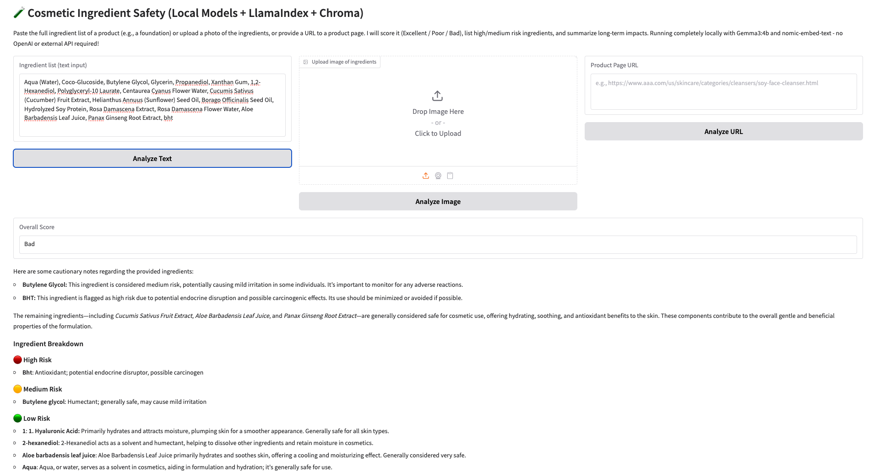

# 🧴 智能代理 AI 化妆品成分风险分析器

一个主动式 AI 助手，用于评估化妆品和护肤产品，提供详细的成分风险分析、产品安全评分以及可操作的建议。

**成分风险分析器**允许用户通过多种输入方式评估化妆品和护肤品，包括**图片上传**、**产品网址**或**手动粘贴成分列表**。它使用 OCR（通过 Tesseract）提取成分，并通过本地知识库（由 **LlamaIndex、ChromaDB 和 Ollama LLM** 提供支持）对每个成分进行分析。对于每个成分，它提供**风险等级**（高、中、低）、解释潜在的**影响**（例如刺激性、毒性、内分泌干扰），并给出**整体产品评分**（优秀、较差或差），为用户提供清晰简明的安全评估。所有处理均在本地完成，确保隐私安全并提供快速性能，无需依赖外部 API。


---

## 🚀 功能特性
- 📸 **图片上传**：上传产品成分表照片 → 使用 OCR 提取文字 → 分析成分。
- 🔗 **URL 输入**：粘贴产品页面链接（例如 Sephora、Clinique） → 自动抓取并分析成分。
- 📋 **手动输入**：直接粘贴成分列表，立即进行分析。
- 🧠 **智能提取**：本地 LLM 仅提取成分，过滤非成分文本。
- 🏷 **产品评分**：评估产品整体安全性。
- 📊 **风险评分**：成分按风险等级分类：
  - **高风险**（例如：对羟基苯甲酸酯类、防腐剂、滑石粉）
  - **中风险**（例如：铝盐、PEG 类）
  - **低风险 / 安全**（常用安全成分）
- 📝 **详细说明**：每个成分提供 **风险等级** + **潜在影响**（例如：刺激性、毒性、内分泌干扰）。
- 🔄 **自动更新数据库**：如果数据库中没有某个成分，系统会自动获取信息并更新本地数据库，使未来分析更快速、更高效。
- 🔒 **本地处理 & 隐私保护**：使用 **LlamaIndex + ChromaDB + Ollama** 完全本地处理，无需调用外部 API。


---

## 🛠 Tech Stack

- **后端**: Python
- **前端**: Gradio

- **OCR**: Tesseract (via pytesseract) 

- **LLM集成n**: LlamaIndex + Ollama (local models)

- **向量数据库 & 本地嵌入**: ChromaDB + 本地 Embeddings（OllamaEmbedding）

---

## 🛠 安装与使用

### 1. 克隆仓库
```bash
git clone https://github.com/yourusername/cosmetic-ingredient-risk-analyzer.git
cd cosmetic-ingredient-risk-analyzer
```

### 2. 创建虚拟环境
```bash
python -m venv venv
source venv/bin/activate   # Mac/Linux
venv\Scripts\activate      # Windows
```

### 3. 安装依赖
```bash
pip install -r requirements.txt
```

### 4. 安装 Ollama（本地大模型运行框架）
请根据官方文档安装：  
👉 https://ollama.ai/download

安装完成后，下载并运行 Gemma3 模型：
```bash
ollama pull gemma3:4b
```

### 5. 运行本地大模型（必须先启动本地 LLM）
```bash
ollama run gemma3:4b
```

### 6. 运行应用
在新的终端窗口中运行：
```bash
python3 app.py
```

### 7. 打开浏览器访问
```
http://localhost:7860
```

---

## 🧪 示例使用场景
- 上传 Clinique 粉底液成分表照片 → 自动提取并标注每个成分风险。  
- 粘贴 Sephora 产品链接 → 自动爬取并分析成分列表。  
- 获取成分风险分解报告（如：parabens 中风险、talc 高风险）。  

---

## 📌 提示
运行应用前，**必须先运行本地 LLM (Gemma3)**，否则成分提取和分析无法进行。  
注意：请确保系统中已经正确安装了 Tesseract，并可以在终端命令行中直接调用 tesseract --version 查看是否安装好。如果没有请使用 
```bash
brew install tesseract
```
## 📸 输出截图
